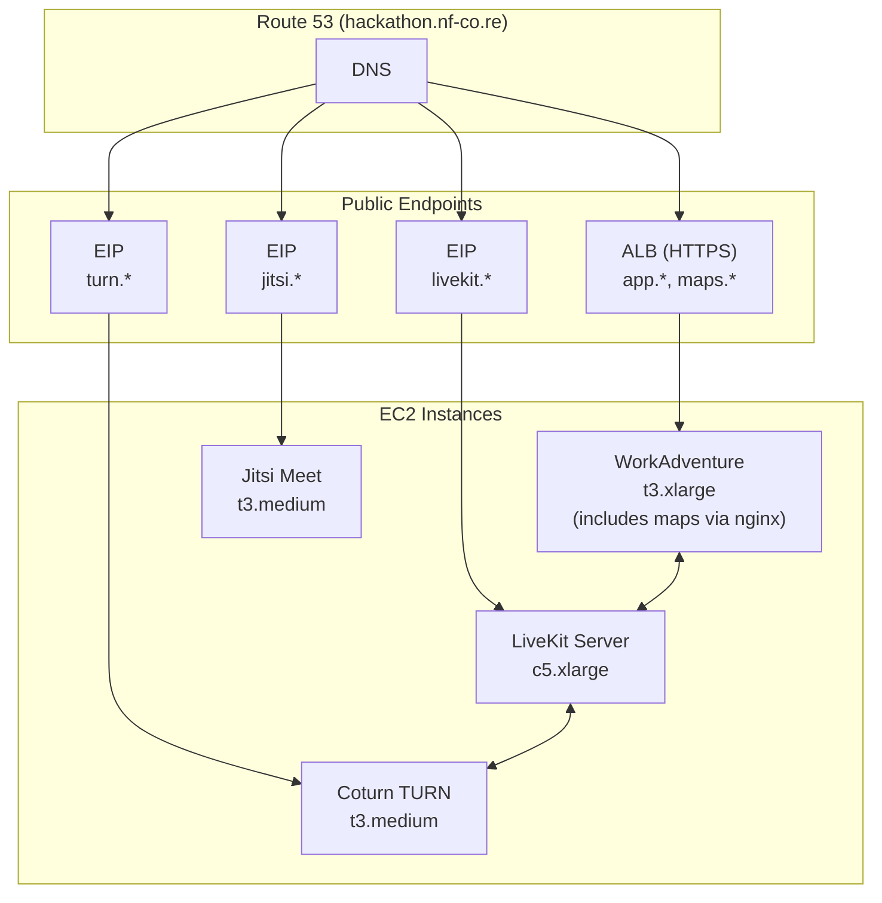

<h1>
<picture>
  <source media="(prefers-color-scheme: dark)" srcset="docs/images/nfcore-hackathoninfra_logo_dark.png">
  <source media="(prefers-color-scheme: light)" srcset="docs/images/nfcore-hackathoninfra_logo.png">
  
</picture>
</h1>

> Terraform infrastructure for the nf-core hackathon virtual event platform

[](#)
[](#)
[](#)

## Overview

This repository deploys the complete virtual event infrastructure for nf-core hackathons:

| Service | Description | URL |
|---------|-------------|-----|
| **WorkAdventure** | Virtual office for the hackathon | [app.hackathon.nf-co.re](https://app.hackathon.nf-co.re) |
| **LiveKit** | Proximity audio/video chat | [livekit.hackathon.nf-co.re](https://livekit.hackathon.nf-co.re) |
| **Coturn** | TURN server for NAT traversal | `turn.hackathon.nf-co.re` |
| **Jitsi** | Video conferencing for meeting rooms | [jitsi.hackathon.nf-co.re](https://jitsi.hackathon.nf-co.re) |

Built with open source software: [WorkAdventure](https://workadventu.re/), [LiveKit](https://livekit.io/), [Coturn](https://github.com/coturn/coturn), and [Jitsi](https://jitsi.org/).

Infrastructure runs in AWS (eu-west-1) and costs approximately **$12/day**.

## Getting Started

This repository is designed for AI-assisted operation. Clone the repo, open it with an AI coding assistant (Claude Code, Cursor, etc.), and describe what you need:

### Edit Maps

Maps define the virtual office layout - rooms, interactive zones, and navigation. Edit them with the [Tiled Map Editor](https://www.mapeditor.org/).

> *"I want to add a new meeting room called 'Quiet Zone' to the map"*
>
> *"Sync the latest map changes to the live server"*

See [`maps/README.md`](maps/README.md) for the full map editing guide.

### Deploy / Teardown / Debug

Manage the infrastructure stack with natural language:

> *"Deploy the hackathon infrastructure"*
>
> *"OAuth isn't working, can you help debug?"*
>
> *"Tear down everything, the event is over"*

The AI reads `CLAUDE.md` for safety rules and loads task-specific skills automatically:

| Skill | When to Use |
|-------|-------------|
| `/deploy` | Setting up for a new event, first-time deployment, recovering from destruction |
| `/teardown` | Event is over, cleanup needed, starting fresh |
| `/debug` | Services unhealthy, users report problems, OAuth/video/maps not working |
| `/maps` | Working with map files, syncing changes, setting up interactive zones |

<details>
<summary><b>For AI Agents</b></summary>

- Read `CLAUDE.md` for core safety rules and guidelines
- Skills are in `.claude/skills/<name>/SKILL.md`
- Always validate each step before proceeding to the next
- Ask for confirmation before any destructive operations

</details>

> **Note:** Maps in the `maps/` folder are the source of truth. Always commit changes to git before tearing down infrastructure.

## Manual Usage

Everything can also be done manually without AI assistance.

### Helper Scripts

| Script | Description |
|--------|-------------|
| `./scripts/validate-env.sh` | Check environment is configured |
| `./scripts/bootstrap.sh` | Create Terraform backend (S3 + DynamoDB) |
| `./scripts/sync-maps.sh` | Sync maps to server |
| `./scripts/status.sh` | Check health of all services |
| `./scripts/ssh.sh <service>` | SSH to instance (wa\|lk\|turn\|jitsi) |

### Terraform Commands

| Command | Description |
|---------|-------------|
| `terraform init` | Initialize Terraform |
| `terraform plan` | Preview changes |
| `terraform apply` | Apply changes (creates/updates infrastructure) |
| `terraform destroy` | Destroy all infrastructure |

### Detailed Procedures

For step-by-step instructions, read the skill files directly:
- **Deploy:** `.claude/skills/deploy/SKILL.md`
- **Teardown:** `.claude/skills/teardown/SKILL.md`
- **Debug:** `.claude/skills/debug/SKILL.md`
- **Maps:** `.claude/skills/maps/SKILL.md`

## Architecture



## Documentation

| Document | Description |
|----------|-------------|
| [docs/architecture.md](docs/architecture.md) | VPC layout, service roles, design rationale |
| [docs/costs.md](docs/costs.md) | Instance sizing, daily costs, tracking via AWS Cost Explorer |
| [docs/branding.md](docs/branding.md) | Customizing logos, sign-in page, social sharing |
| [maps/README.md](maps/README.md) | Map editing guide for Tiled |

## Directory Structure

```
.
├── CLAUDE.md                 # AI agent instructions (always loaded)
├── README.md                 # This file
├── docs/                     # Human-readable documentation
│   ├── architecture.md       # Design rationale and VPC layout
│   ├── costs.md              # Cost estimates and sizing
│   └── branding.md           # Customization guide
├── .claude/
│   └── skills/               # Task-specific AI skills
│       ├── deploy/
│       ├── teardown/
│       ├── debug/
│       └── maps/
├── terraform/                # Infrastructure code
│   ├── main.tf
│   ├── variables.tf
│   ├── outputs.tf
│   └── modules/
├── maps/                     # WorkAdventure map files
│   ├── README.md             # Map editing guide (for humans)
│   └── default/
└── scripts/                  # Helper scripts
    ├── validate-env.sh
    ├── bootstrap.sh
    ├── sync-maps.sh
    ├── status.sh
    └── ssh.sh
```

## Prerequisites

- AWS CLI configured with `nf-core` profile
- Terraform >= 1.0
- direnv (for environment management)
- 1Password CLI (for secrets)
- Access to nf-core AWS account
