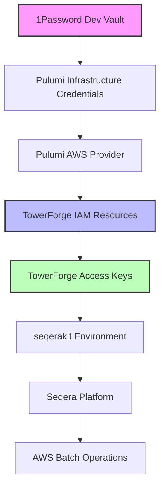

# AWS Credentials Architecture

This document describes the credential management architecture for the AWSMegatests infrastructure, which implements proper separation between infrastructure management and AWS Batch operations.

## Architecture Overview

The credential architecture follows a clean separation pattern with two distinct credential sets:

1. **Pulumi Infrastructure Credentials**: For managing AWS resources via Infrastructure as Code
2. **TowerForge Credentials**: For AWS Batch operations via Seqera Platform

## Credential Flow Diagram



## Detailed Flow

### Phase 1: Infrastructure Bootstrap

```
1Password Dev Vault
    ↓ (via .envrc)
Pulumi Infrastructure Credentials
    ↓
AWS Provider in Pulumi
    ↓
Creates TowerForge IAM Resources
```

### Phase 2: TowerForge Credential Creation

```
TowerForge Module (towerforge_credentials.py)
    ↓
Creates IAM User + Policies + Access Keys
    ↓
Returns Access Key ID & Secret
    ↓
Passed to seqerakit Environment Variables
```

### Phase 3: Platform Operations

```
seqerakit receives TowerForge credentials
    ↓
Deploys compute environments to Seqera Platform
    ↓
Platform uses TowerForge credentials for AWS Batch
    ↓
AWS Batch operations (job submission, monitoring, etc.)
```

## Credential Sets

### Pulumi Infrastructure Credentials

- **Source**: 1Password Dev vault (`AWS megatests` item)
- **Purpose**: Infrastructure as Code operations
- **Scope**: S3 bucket management, IAM resource creation, basic AWS operations
- **Storage**: Persistent in 1Password
- **Access Pattern**: Loaded via `.envrc` → Environment variables → Pulumi AWS provider

### TowerForge Credentials

- **Source**: Generated by Pulumi via `towerforge_credentials.py`
- **Purpose**: AWS Batch operations via Seqera Platform
- **Scope**: Batch Forge + Launch + S3 bucket access
- **Storage**: Ephemeral (no persistent storage)
- **Access Pattern**: Pulumi → AWS IAM → seqerakit → Platform

## IAM Policies

### TowerForge IAM Policies

The TowerForge user has three attached policies:

#### 1. TowerForge-Forge-Policy

- **Purpose**: Resource creation and management
- **Key Permissions**:
  - IAM role/instance profile management
  - Batch compute environment creation
  - EFS/FSx file system management
  - EC2 launch template management

#### 2. TowerForge-Launch-Policy

- **Purpose**: Pipeline execution operations
- **Key Permissions**:
  - Batch job submission and monitoring
  - ECS task management
  - CloudWatch Logs access
  - EC2 instance inspection

#### 3. TowerForge-S3-Policy

- **Purpose**: S3 bucket access
- **Key Permissions**:
  - ListBucket on `nf-core-awsmegatests`
  - GetObject/PutObject/DeleteObject on bucket contents
  - PutObjectTagging for file classification

## Security Benefits

### Credential Separation

- **Infrastructure credentials**: Limited to infrastructure management
- **TowerForge credentials**: Scoped specifically for Batch operations
- **Principle of least privilege**: Each credential set has minimal required permissions

### No Persistent Storage of TowerForge Credentials

- **Ephemeral**: TowerForge credentials exist only during deployment
- **No 1Password storage**: Eliminates unnecessary credential persistence
- **Automated generation**: Credentials created fresh on each deployment

### Audit Trail

- **Clear separation**: Operations can be traced to specific credential sets
- **AWS CloudTrail**: All actions tagged with appropriate IAM user
- **Pulumi state**: Infrastructure changes tracked in IaC state

## File Structure

```
AWSMegatests/
├── __main__.py                    # Main Pulumi program (orchestration)
├── towerforge_credentials.py      # TowerForge IAM resource creation
├── .envrc                        # Environment variables (1Password integration)
├── CREDENTIALS.md                # This documentation
└── seqerakit/                    # Seqera Platform configurations
    ├── *.yml                     # Compute environment configs
    ├── *.json                    # Environment specifications
    └── *-nextflow.config         # Nextflow configuration files
```

## Environment Variables

### Pulumi Infrastructure (.envrc)

```bash
# Infrastructure management credentials
from_op AWS_ACCESS_KEY_ID="op://Dev/AWS megatests/username"
from_op AWS_SECRET_ACCESS_KEY="op://Dev/AWS megatests/password"

# Other infrastructure variables
export AWS_REGION="eu-west-1"
export AWS_WORK_DIR="s3://nf-core-awsmegatests"
```

### seqerakit Environment (runtime)

```python
seqerakit_environment = {
    # TowerForge credentials (generated by Pulumi)
    "AWS_ACCESS_KEY_ID": towerforge_access_key_id,
    "AWS_SECRET_ACCESS_KEY": towerforge_access_key_secret,

    # Platform configuration
    "TOWER_ACCESS_TOKEN": tower_access_token,
    "TOWER_WORKSPACE_ID": tower_workspace_id,
    # ... other variables
}
```

## Deployment Commands

### Infrastructure Deployment

```bash
# Ensure credentials are loaded
direnv allow

# Deploy infrastructure with proper credential separation
direnv exec . uv run pulumi up
```

### Credential Flow Verification

```bash
# Check Pulumi credentials
direnv exec . aws sts get-caller-identity

# Check TowerForge user creation (after deployment)
aws iam get-user --user-name TowerForge-AWSMegatests

# List attached policies
aws iam list-attached-user-policies --user-name TowerForge-AWSMegatests
```

## Troubleshooting

### Common Issues

#### 1. "No valid credential sources found"

- **Cause**: Pulumi infrastructure credentials not loaded
- **Solution**: Use `direnv exec . uv run pulumi <command>`

#### 2. "Access Denied" in seqerakit operations

- **Cause**: TowerForge credentials not properly generated or passed
- **Solution**: Check Pulumi deployment logs for TowerForge resource creation

#### 3. "User already exists" errors

- **Cause**: Previous TowerForge user not cleaned up
- **Solution**: Remove existing user or use `pulumi refresh` to sync state

### Credential Rotation

```bash
# Rotate TowerForge credentials (regenerates access keys)
direnv exec . uv run pulumi up

# Rotate infrastructure credentials
# Update in 1Password, then reload environment
direnv reload
```

## Security Considerations

### Best Practices Implemented

- ✅ **Credential separation**: Different credentials for different purposes
- ✅ **Minimal permissions**: Each credential set has only required permissions
- ✅ **Ephemeral TowerForge credentials**: No persistent storage
- ✅ **Secure storage**: Infrastructure credentials in 1Password
- ✅ **Automated rotation**: TowerForge credentials recreated on each deployment

### Access Control

- **Infrastructure credentials**: Limited to authorized operators with 1Password access
- **TowerForge credentials**: Never directly accessible to operators
- **Seqera Platform**: Uses TowerForge credentials for AWS operations only

## References

- [AWS Batch Forge Documentation](https://docs.seqera.io/platform-cloud/compute-envs/aws-batch#batch-forge)
- [TowerForge IAM Policies](https://github.com/seqeralabs/nf-tower-aws)
- [Pulumi AWS Provider Documentation](https://www.pulumi.com/registry/packages/aws/)
- [1Password CLI Integration](https://developer.1password.com/docs/cli/)

---

_Last updated: August 2024_
_Architecture version: 2.0 (Separated credentials)_
